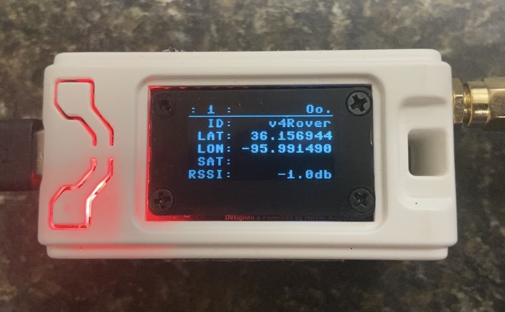
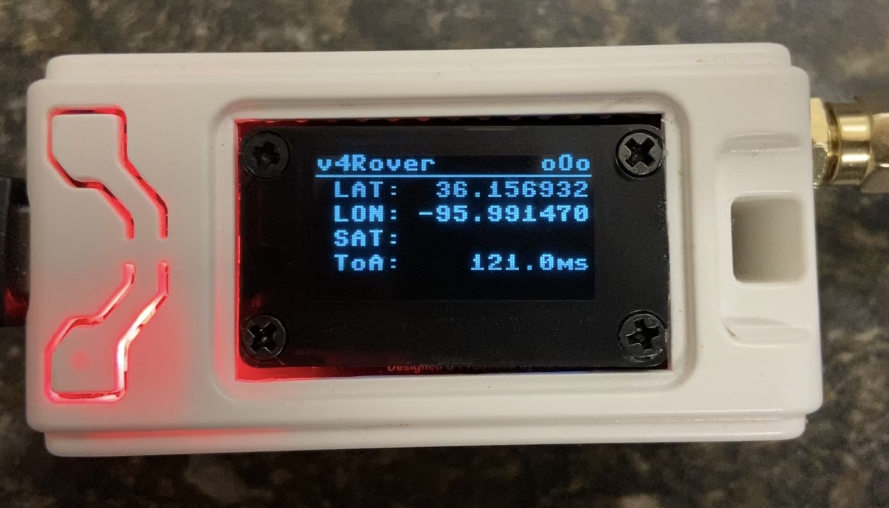
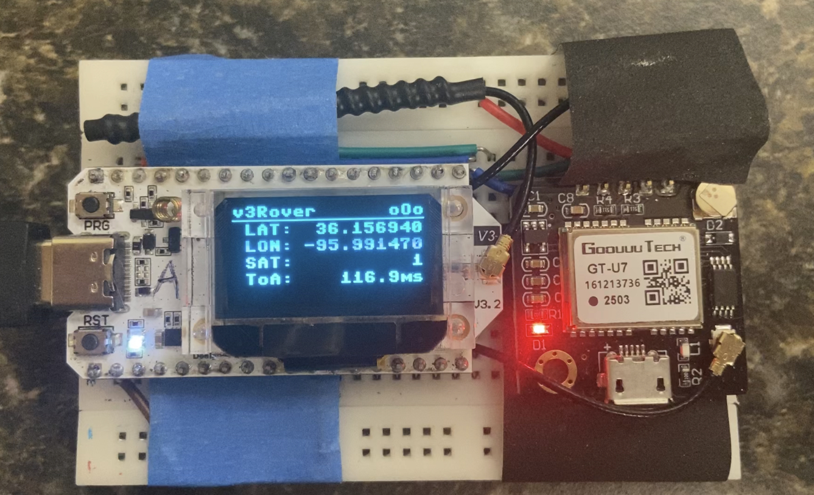
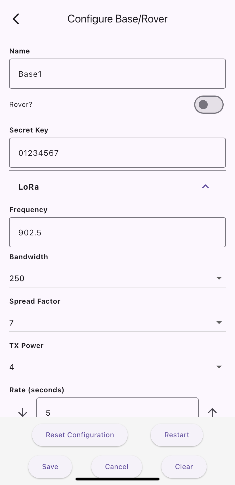
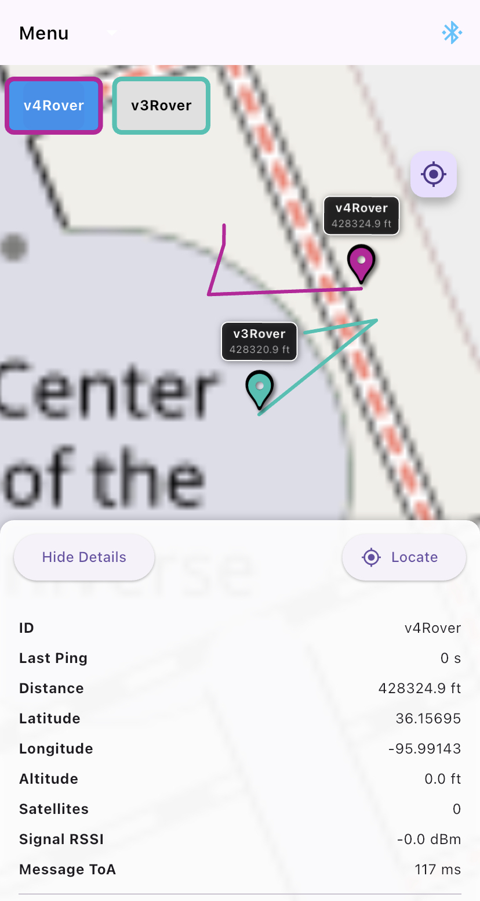

# Daisy's Chain

## Micropython ESP32 LoRa pet tracker

### Features

- Rover (tracker), Base (receiver)
- Track multiple rovers
- Switch device role between rover/base with `is_rover` configuration option
- XOR encryption of LoRa transmission (secret specified in configuration)
- BLE connection to device for configuration (base/rover) and tracking (base)

### Hardware

Project was written using Heltec WiFi LoRa 32 [v3](https://heltec.org/project/wifi-lora-32-v3/) and [v4](https://heltec.org/project/wifi-lora-32-v4/) devices, but could potentially be tailored for use with any ESP32 based device running micropython with hardware requirements met. Board configurations are located in `lib/board`, and board configuration loaded is specified in `/board.txt` on device.

#### Requirements
- ESP32 device with 512K SRAM (ESP32-S3 was used for build)
- LoRa radio module
- GPS module (for rover)
- Bluetooth Low Energy (mobile app access)

#### Set-up

1. [Install micropython to ESP32 device.](https://docs.micropython.org/en/latest/esp32/tutorial/intro.html)
There are various methods to achieve this, below are a couple common tools.

    - [Thonny](https://thonny.org/) - Windows GUI
    - [ESPTool](https://github.com/espressif/esptool) - CLI based

2. Copy `lib` and `main.py` to device.

3. If using device other than Heltec WiFi LoRa 32 v3, specify in `board.txt` file. (If unspecified, defaults to GENERIC which is based on Heltec WiFi Lora 32 v3)

4. After first start of device, configuration file `config.json` is created and settings can be changed by editing file and restarting device. Configuration can also be read/modified through BLE.

#### Default LoRa configuration

  - Frequency: 902.5 MHz
  - Bandwidth: 250 kHz
  - Spread Factor: 7
  - Transmit Power: 5 dBm
  - Interval: 5 seconds

### Usage

#### Buttons

- Rover/Base Press `USR` button >5 seconds deep-sleep device
- Rover
  - Tap `USR` button to cycle through recognized (tracked) rovers
  - Press `USR` <4 seconds to remove selected (tracked) rover

#### Rover behavior

- Once device gets GPS fix, will LoRa transmit id, coordinates, timestamp, and other data as XOR encrypted json string

#### Base behavior

- Receives encrypted json string transmission from rover and displays coordinates, RSSI, and other data to display (optional)
- Sends received coordinate data from rover to connected device via BLE (unencrypted)

### Notes

Some debugging features/options are intentionally left in place, all of which can be enabled/disabled through config.json or BLE.

  - `mock` GPS coordinates set in gps.py for bench testing (currently centered at 'Center of the Universe', Tulsa, Oklahoma, US)
  - `debug_v` options for modules to output module specific debug messages to serial
  - `wd` watchdog configuration option to automatically restart device on hang

This is probably over-engineered for a pet tracker, but seems to work pretty well. I wasn't *just* trying to make a pet-tracker with this project, but learn and utilize some of the facilities in micropython as I went.

### ToDo

  - Report battery status
  - Hot-reload some configuration options without device restart
  - Refactor and clean-up configuration/preference loading code
  - Clean up app code and add to repository
  - Make a better todo list :stuck_out_tongue:

---

### Device Images

| Heltec v4 Base | Heltec v4 Rover (L76K GPS module) | Heltec v3 Rover (GT-U7 GPS module) |
| :---: | :---: | :---: |
|  |  |  |

---

### App Screenshots

| Connect | Configure | Map |
| :---: | :---: | :---: |
|  |  |  |
